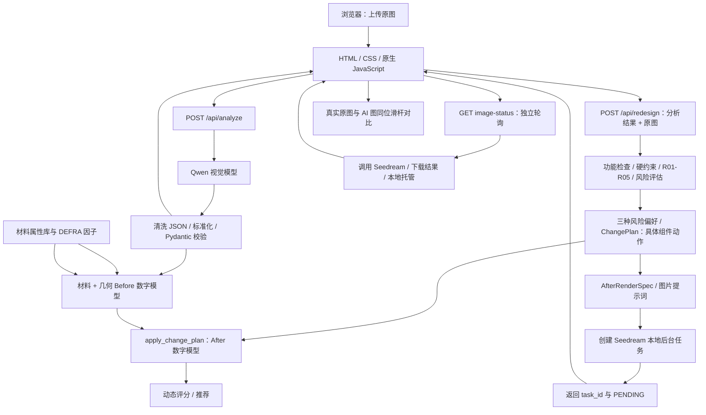

# 智减技术架构与评分机制

> 文档日期：2026-09-07。依据当前本地工作区代码编写，包含材料/几何数字模型与动态评分升级；Git 基础提交为 `3dc73e8`。
> 本文不是线上版本核验报告，不能据此认定 Render 已同步这些修改。现有网站入口为 [智减](https://packless-backend.onrender.com/)。

## 1. 系统定位与职责边界

智减是一款 AI 驱动的包装减量与材料优化决策 MVP。核心流程是：识别包装 → 识别功能和约束 → 选择规则方案 → 估算指标 → 生成包装概念图 → Before / After 对比。

系统不是实测检测仪、认证工具或完整生命周期评价（LCA）系统。方案中的安全性与可制造性是待验证的工程假设，不代表经过跌落、运输、迁移或食品接触测试。

|能力|当前实现|不应混淆为|
|---|---|---|
|视觉识别|Qwen 识别图片中的产品、组件、材料线索及问题|材料实验室鉴定、精确测量|
|方案决策|确定性规则、风险过滤、评分与推荐|LLM 自由创造并决定方案|
|方案说明|规则服务中的自然语言模板|另一次 LLM 解释调用|
|优化图|Seedream 5.0 Pro 根据原图和已批准动作生成概念图|经工程验证的成品、完整验证了所有动作的图像|
|Before / After 指标|统一估算服务，附来源与验证状态|实测改善幅度|
|材料碳数据|本地材料映射与 DEFRA 参考因子|完整产品碳足迹、认证减排量|
|材料目录|静态预设目录|实时供应商数据库或自动读取全部 DEFRA 材料|

## 2. 技术架构

### 2.1 总体结构

采用单仓库、单 FastAPI 服务托管前后端的架构。浏览器使用相对路径请求同源 API；不需要单独部署前端服务器。



图中的数据引用在分析路由完成识别后附加；估算和图像提示词消费同一套获批动作，避免指标和视觉指令分离。

### 2.2 技术栈与模块

|层级|技术 / 模块|职责|
|---|---|---|
|前端|HTML、CSS、原生 JavaScript|文件上传、请求编排、指标展示、图像预加载、滑杆与错误状态|
|Web 服务|FastAPI、Uvicorn|路由、静态托管、健康检查、OpenAPI|
|数据契约|Pydantic 2|分析、规则机会、方案、指标与响应结构|
|视觉分析|DashScope SDK、Qwen|图片 data URL 输入、JSON 输出|
|图像生成|火山方舟图片生成 API、Seedream 5.0 Pro|参考图编辑、本地后台任务适配|
|图像处理|Pillow、httpx|图片规范化、下载与保存|
|配置|python-dotenv、环境变量|读取模型名和密钥|
|数据层|本地 JSON / CSV / 映射文件|只读参考数据，无数据库|
|测试|pytest、FastAPI TestClient|规则、解析、API、估算、任务异常回归|

仓库内关键位置（以下均为仓库相对路径）：

```text
packless-backend/
├── frontend/index.html                 # 页面、交互和请求调用链
├── frontend/generated/                 # 运行时生成图
├── app/main.py                         # FastAPI 与静态资源入口
├── app/routers/
│   ├── analyze.py                      # 上传分析
│   ├── redesign.py                     # 规则方案、任务提交、状态接口
│   └── materials.py                    # 静态材料目录
├── app/services/
│   ├── ai_analyzer.py                  # Qwen 调用、输出清洗与解析
│   ├── analysis_normalizer.py          # 字段兼容、默认值和结构标准化
│   ├── rule_engine.py                  # 功能、约束、规则及风险矩阵
│   ├── redesign_service.py             # 方案选择、ChangePlan 与流程编排
│   ├── geometry_estimator.py            # 几何、占用率和安全缩容估计
│   ├── packaging_state.py               # Before 数字模型与 After 变换
│   ├── scoring_engine.py                # 环境、商业、供应链动态评分
│   ├── packaging_estimator.py          # 前后指标与估算一致性
│   ├── prompt_builder.py              # 分析提示词与获批结构动作提示词
│   ├── image_generator.py             # Seedream 调用、任务状态与结果图片托管
│   └── material_data_service.py        # 材料映射与碳参考计算
├── app/schemas/models.py               # 响应模型和新增兼容字段
├── app/mock/mock_data.py               # 仍供材料目录使用的预设数据
├── data/processed/                     # 离线标准化数据、DEFRA 因子
├── data/materials/material_properties.json # 材料物性、工程范围与来源
├── data/mappings/                      # 名称、分类、因子映射
├── scripts/ingest_material_data.py      # 离线数据接入脚本
├── tests/
└── requirements.txt
```

## 3. 接口及调用链

### 3.1 接口表

|方法与路径|输入|主要输出 / 用途|
|---|---|---|
|GET `/`|无|返回前端 HTML，不是 JSON|
|GET `/health`|无|`{"status":"healthy"}`|
|GET `/docs`|无|Swagger 页面|
|GET `/openapi.json`|无|FastAPI schema|
|POST `/api/analyze`|multipart：必填 `image`|`success + data`，含识别信息、分析 ID、碳参考|
|POST `/api/redesign`|multipart：`analysis_result` JSON 字符串、可选 `image`；也支持 JSON 分析对象|三方案、推荐、指标、ChangePlan、AfterRenderSpec、图片任务状态|
|GET `/api/redesign/image-status/{task_id}`|任务 ID|`data.status`、`optimized_image_url`、`error`|
|GET `/api/materials`|无|预设材料目录|
|GET `/generated/...`|文件路径|已下载的优化图片|
|GET `/static/...`|文件路径|前端目录内的静态资源|

`/api/redesign` 当前没有必需的 `mode` 参数。只提交分析 JSON 可以得到规则方案，但没有原图就不会提交图像任务。

成功业务响应沿用 `{"success":true,"data":{...}}`；请求或分析错误使用 `success:false` 与 `error.code/message`。图片生成失败不会抹掉已成功生成的规则方案，因此不能仅凭 `/api/redesign` 的 HTTP 200 或 `success:true` 判断出图成功。

### 3.2 分析流程

1. 前端保留用户上传文件，并通过 `URL.createObjectURL` 显示原始 Before 图。
2. `/api/analyze` 检查上传的 MIME 类型和图片是否为空。
3. `ai_analyzer` 将字节编码为图片 data URL，在线程中调用 Qwen，避免同步 SDK 阻塞事件循环。
4. 请求 JSON 输出模式；清除 Markdown 包裹与前后说明，提取完整 JSON 对象。
5. 标准化同义字段、补默认值，再进行模型校验；仍无法解析时返回明确错误，不静默回退假分析。
6. 附加材料碳参考后，前端继续自动请求 redesign。

模型默认 `qwen3-vl-plus`，由 `DASHSCOPE_VISION_MODEL` 覆盖。数字不确定时可为空；估算服务随后基于组件线索补充受约束的 Demo 估计。

### 3.3 Seedream 后台任务流程

模型默认 `doubao-seedream-5-0-pro-260628`，由 `SEEDREAM_IMAGE_MODEL` 覆盖。提供方使用火山方舟同步图片生成接口；服务层将其包装为原有的提交/轮询契约。

```text
POST /api/redesign
  → 计算规则与评分
  → 原图 + ChangePlan + AfterRenderSpec 构造提示词
  → 规范化参考图并创建本地 task_id
  → 返回 image_task_id、image_generation_status=PENDING

浏览器 GET /api/redesign/image-status/{task_id}
  → 返回缓存状态，并按需启动后台 Seedream 请求
  → POST 火山方舟 /api/v3/images/generations
  → 提取临时图片 URL、下载并保存
  → 本地图片可用才标记 SUCCEEDED
  → 浏览器收到 /generated/... 并预加载 After 图
```

|阶段|当前限制|
|---|---|
|Seedream HTTP|连接 10 秒、读取 180 秒；后台执行|
|整个后台生成|应用等待上限 210 秒，不阻塞 redesign 与状态请求|
|前端 redesign 请求|55 秒超时|
|结果下载阶段|异步等待上限 95 秒|
|浏览器状态轮询|每次先等 2.5 秒，最多 90 次；单次请求超时 10 秒|
|任务缓存|进程内字典，上限 1024 项；新提交时清理超过 3600 秒且无运行工作项的记录|

轮询总时长还包括每次 HTTP 耗时，不应把它宣称为严格 225 秒完成。提供方请求在线程中执行，状态接口只返回缓存快照，不阻塞浏览器请求。

After 使用服务返回的 `optimized_image_url`，成功预加载后赋给 `afterImage.src`。Before 与 After 同位置、同尺寸、`object-fit:contain`，通过裁剪区域和 Pointer Events 实现鼠标/触屏滑杆。失败显示错误和重新生成入口，不把 CSS 包装模型冒充这次生成结果。

## 4. 四层规则引擎

### 4.1 功能识别

根据组件名称、材料、可见证据和显式功能信息，推断保护、缓冲、密封、防潮、阻隔、展示、运输、品牌表达、装饰。

每个组件记录 `essential`、`potentially_redundant`、`decorative`、`protective`、`barrier`、`brand_critical`，以及 `confidence` 和假设说明。它们是启发式功能判断，不是经过校准的安全概率。

### 4.2 硬约束

保护与缓冲功能必须保留；食品需要接触安全及屏障保护；电子产品需保护、潜在 ESD 等验证；品牌识别和法定信息不得随意删除。

实现中逐个过滤危险机会，再组合方案。未知目标、删除必要组件、危险材料替换不会因为分数高或视觉效果强就获得豁免。当前食品及电子品类不默认批准塑料内托换纸浆模塑。

### 4.3 优化规则与结构动作

|规则|触发和边界|具体动作|视觉影响|
|---|---|---|---|
|R01 减层|明确、可信的非必要装饰组件；或模型明确标记为非必要、非保护、非屏障且置信度不低于0.4的待验证组件；不删除保护/密封/屏障/关键品牌件|对命名组件 `remove`|high|
|R02 缩容|几何置信度不低于0.55、建议外包装体积比不高于0.92；仅泛化 medium 先验不足以触发|外盒 `resize`，内托 `resize_to_fit`|high|
|R03 减塑|区分非功能膜、有功能膜和塑料内托|`remove`、`lightweight` 或 `replace_material`|移膜 medium；换托 high；薄膜减薄 low|
|R04 材料简化|非保护性塑料装饰件，并有明确纸盒接收目标|`integrate_into`，转换为纸盒印刷/压纹|medium|
|R05 再生来源|已有纤维组件，需材料与工艺验证|`increase_recycled_content`，不改产品与外观|low|

R02 优先用产品占用比例和目标安全利用率计算最小安全外体积，再得到保留外体积比例 `scale`；只有几何证据不足时才使用原离散档位。`scale` 表示外盒体积比例，不是图片比例，也不是长宽高分别乘同一比例。缩容方案仍要求产品尺寸不变、空隙减少、内托适配和运输验证。

`HC_PROTECTION` 用于限定 `minimum_safe_dimensions` 和验证要求，不会仅因组件具有保护功能就禁止 R02。只有建议体积比接近当前体积（大于0.92）或几何置信度不足时，才不生成缩容候选。

### 4.4 商业与供应链风险

每个机会评估六项风险：成本、品牌体验、消费者体验、工艺兼容、材料可得性、运输保护。

```text
commercial_risk = max(成本风险, 品牌体验风险, 消费者体验风险)
supply_chain_risk = max(工艺兼容风险, 材料可得性风险, 运输保护风险)
```

`max` 使用等级顺序 low < medium < high；未知风险保守处理。当前矩阵汇总结果：

|动作|商业风险|供应链风险|
|---|---|---|
|减层|medium|medium|
|缩容|medium|high|
|移除非功能薄膜|medium|medium|
|薄膜轻量化|medium|high|
|替换内托|medium|high|
|材料简化|medium|high|
|增加再生材料比例|medium|medium|

这些风险是人工配置的 MVP 先验，不是实时报价、产线数据或供应商调查结果。

## 5. 三方案选择与推荐

### 5.1 风险偏好

|方案|选择逻辑|
|---|---|
|aggressive|选择全部通过硬约束的机会，再去除动作冲突|
|balanced|按环境权重 × 置信度排序；常规选择商业/供应风险不超过 medium、置信度至少 0.5 的前四个|
|low_risk|商业和供应链风险均为 low、置信度至少 0.65，最多两个|

Balanced 的附加视觉约束：如果存在置信度至少 0.65、视觉影响为 medium/high、带具体动作的安全机会，而常规选择未包含任何这样的机会，则加入排名最高的一个，并保留最多三个常规机会。因此可能纳入供应链 high 的条件性方案，但不会绕过硬约束。

动作冲突检查会避免删除后继续修改同一组件，或将装饰合并到已经删除的目标。R05 排在结构动作之后处理。

当前风险矩阵没有商业与供应风险同时为 low 的既有规则动作，所以 `low_risk` 通常是保留现状的方案；不是程序漏生成。

### 5.2 Environment Score

环境分读取同一方案的 Before/After 数字模型，不再按规则 ID 固定加分：包装质量减量25%、塑料减量20%、参考碳排减量30%、可回收性改善15%、空间效率改善10%。前三项使用分段线性映射：0%→0，10%→40，20%→70，30%及以上→100；可回收和空间每改善1个百分点贡献4个子分，上限100。

Before 塑料为0或某项数据缺失时，该项不作为惩罚，权重按其余可用项重分配。可用维度加权归一化后采用45分的MVP保守基线下限。`score_breakdown.environment` 返回每项变化、子分和是否发生权重重分配。

### 5.3 Business / Supply Chain Score

商业分由材料成本方向25%、工序简化20%、品牌保持20%、开箱体验15%、改造投入20%加权形成。供应链分由材料可得性25%、供应商准备20%、产线兼容20%、模具准备15%、运输保护20%加权形成。两者均限制在0–100，每个子项都在 API 的 `score_breakdown.items` 中返回分数、权重、解释和来源。

相对成本指数和风险矩阵是带来源声明的V1工程估计，不是供应商报价。`score_breakdown.business/supply_chain` 会列出估计成本变化、风险等级、是否需新供应商/模具及产线兼容性。

### 5.4 总分与推荐

```text
overall_score = round(
    0.4 × environment_score
  + 0.3 × business_score
  + 0.3 × supply_chain_score
  - no_improvement_penalty,
  1
)
```

商业与供应链分数越高越好，因此权重均为正号。

1. 按综合分降序排列。
2. 最高两个方案差值严格小于 3 分时，在这两个方案中优先供应链分更高者。
3. 若供应链分也相同，优先 balanced。
4. 否则选择综合分最高者。

推荐前先执行最低有效改善过滤：包装或塑料减量超过5%、空间利用率提高超过5个百分点、可回收评分提高超过5分，或参考碳排下降超过5%，任一满足即视为有效改善。只要存在有效改善方案，完全不变的低风险方案不会仅凭供应链高分获胜；只有全部方案都无有效改善时才共同参与推荐。

没有达到有效改善阈值的方案额外扣15分。低于0.5置信度的删除或合并动作还会对商业与供应链分施加验证风险惩罚，避免证据薄弱的激进方案仅靠环境收益被误推荐。

这意味着推荐方案不一定是环境分最高者，也不一定是视觉变化最大的方案；不同风险偏好可能选出相同规则集。

### 5.5 可复算示例

规则引擎只批准动作和披露风险；数字模型计算动作后的材料、质量、空间、回收与碳变化；评分引擎最后消费这些变化。同一个 R03 对“移除2g薄膜”和“替换大型PET内托”不会得到相同环境分，也不会再稳定输出54/92/92。

## 6. Before / After 指标机制

这些指标与上一章的方案三维评分是两套不同机制。分析响应中的 `diagnosis.overall_score`、`packaging.recyclability_score` 也不能直接当作方案综合分。

### 6.1 来源标签

|来源|含义|当前页面标签|
|---|---|---|
|measured|调用方显式提供数值及测量证据；系统未独立验证该声明|实测|
|estimated|图像线索与类型范围估计|AI估计|
|inferred|基于规则的推断及方案 After 值|规则估计|
|pending|缺少足够线索或无法分配材料质量|暂无法估算|

每项指标保留 `value`、`source`、`range`、`confidence`、`estimated`、`requires_validation`、`hypothesis`。范围是启发式边界，不是统计置信区间。应优先读取逐指标来源；顶层 `estimated=true` 是整组估算场景声明。

After 即使沿用实测 Before 数值，也仍是未来方案的推断值，不自动成为实测。

### 6.2 数据优先估算

|指标|Before 数字模型|After 数字模型|
|---|---|---|
|层数|可见、去重后的组件数量；排除名称含 label/logo/标签/印刷的项；无组件时尝试识别层数|按批准删除或合并的层组件数量减少，至少保留一层|
|塑料克数|薄膜按面积×厚度×密度；PET内托按展开体积×厚度×密度；逐组件求和|执行获批移除、轻量化或材料替换后重新汇总|
|空间利用率|产品占用体积/外包装体积；只有单图时用2D视觉占比代理|保持产品占用量，以安全外体积重新计算，上限95%|
|包装克数|纸盒表面积×克重×结构余量；薄膜/内托用物性；逐组件求和|对同一组件清单执行 ChangePlan 后重新汇总|
|可回收评分|按组件质量加权材料基础分，并考虑材料种类复杂度|移除、替换、整合及再生来源动作后重算|

数据优先级为：用户实测 > 可用材料/参考数据 > AI视觉几何估计 > 规则区间回退。几何不足或材料属性无法映射时，才使用原有薄膜、托盘、袋、盒型区间；无法合理回退则保留待实测。

未知内衬等次要组件采用明确的组件类型区间兜底：例如无法确认材质的内衬使用4–12g范围的保守中值7g，返回 `component_type_fallback`、低置信度及 `requires_validation=true`。一个未知组件不会再清空其他已估算组件的总重量。

有可见组件但未识别出塑料时可显示 0g，含义是“可见识别结果未发现塑料”，不能解释为“整包无塑料”。R04 本身没有 R03 时，不单独下调塑料克数；这是当前一致性规则的保守限制。

用户提供长宽高和总质量时覆盖视觉估计；`geometry.method` 区分 `visual_2d_proxy`、`estimated_3d_volume` 与 `pending`，并保存来源、置信度及是否估算。AI只给2D占用率时不伪装成3D实测。

可回收基准：全纸类80；纸类+塑料薄膜+内托50；纸类+其他已识别塑料65；其余有组件情况40；无组件则待实测。这个分数不是地区回收设施适配度或认证可回收率。

全局约束：层数1–8、塑料0–500g、总包装10–2000g、利用率20–95%、回收评分0–100。

### 6.3 一致性保护

代码验证：减层必须有删除/合并清单及具体动作；After 层数必须与 `target_layer_count` 一致；利用率上升必须有 R02 和缩容/布局指令；塑料下降必须有 R03；回收评分上升必须有 R03/R04/R05。

统一页面声明：“以下指标为AI/规则估算，最终以实际测量和工程验证为准。”

## 7. ChangePlan 与 AI 图的可追溯性

`component_actions` 是具体动作清单，每项包含组件名、动作、规则 ID、原因、置信度、估算与验证标志。

ChangePlan 还包含：`reduce_layers`、`target_layer_count`、`remove_components`、`merge_components`、`preserve_components`、`resize_spec`、`visual_change_summary/strength/note`。为兼容旧前端，`resize_outer_box` 保留字符串，新结构化缩容数据放在 `resize_spec`。

AfterRenderSpec 传递组件动作、保留/删除组件、目标层数、外体积比例、空隙减少、品牌保留要求。

提示词要求：保持产品、Logo、品牌色、摄影角度、背景和光线；按批准动作改变包装；不能只重新配色，也不能缩小整张图。图像生成前由 `build_visual_change_summary` 列明可见变化。仅 R05 等低变化方案会显示“本方案以材料来源优化为主，结构变化较小”。

生成后使用对齐图片差异代理检查可见变化强度；低于阈值时最多用强化提示词重试一次。该代理只能识别整体视觉变化，不证明 Seedream 正确执行了每项动作，发布概念图仍需人工审阅。

## 8. 数据接入与碳估算

运行时读取已处理 JSON，无需访问开发电脑的桌面目录或 Excel。C 数据为用户提供的识别参考记录，不是人工真值；PackWISE 处理结果是元数据，不代表模型训练；D 示例计算不作为当前包装默认测量值。

DEFRA 因子加载会校验来源字段、原始单位、转换除数及数值一致性：

```text
factor_kgCO2e_per_kg = 原始 kgCO2e/tonne ÷ 1000
estimated_CO2e_kg = 材料质量_g ÷ 1000 × factor_kgCO2e_per_kg
```

系统有两条明确区分的路径：

1. `carbon_data` 材料参考路径：保留原始材料声明，同时接收数字孪生的 `weight_kg`、逐组件估算质量和 `estimated_total_co2e_kg`；这些字段始终标记为估算且需要验证。
2. `carbon_data.visual_estimate`：采用估算质量；单一材料或受支持的纸+塑料质量分配才能计算，不重复把整包重量计入每种材料。

数字模型路径会为可映射的每个 Before/After 组件重新计算材料质量与参考碳排。质量优先级为组件直接估算、几何物性估算、视觉占比分配、包装类别/组件角色回退；次要未知组件可采用已识别主要材料的加权排放因子代理，并明确标记为推断。只有无法识别任何主要材料、没有可用质量/比例且关键因子均缺失时才保持暂无法估算。DEFRA 因子进入 `carbon_reduction_score`，从而直接影响环境分。

## 9. 部署、配置与运行边界

仓库部署根目录是包含 `app/`、`frontend/`、`requirements.txt` 的 `packless-backend` 层。

```bash
# Build Command
pip install -r requirements.txt

# Render Start Command：Linux shell 展开 PORT
uvicorn app.main:app --host 0.0.0.0 --port $PORT

# 本地启动
uvicorn app.main:app --reload
```

以上为该代码结构对应的命令，不代表本次读取了 Render 控制台设置。前端入口缺失时启动会明确报错。

|环境变量|用途|
|---|---|
|`DASHSCOPE_API_KEY`|Qwen 视觉分析；本地 .env 或部署平台环境变量|
|`DASHSCOPE_VISION_MODEL`|可选，默认 qwen3-vl-plus|
|`ARK_API_KEY`|Seedream 5.0 Pro 的火山方舟 API Key|
|`SEEDREAM_IMAGE_MODEL`|可选，默认 doubao-seedream-5-0-pro-260628|
|`SEEDREAM_API_URL`|可选，默认北京地域方舟图片生成接口|
|`SEEDREAM_IMAGE_SIZE`|可选，默认 2K|
|`PORT`|部署平台提供给启动命令|

不应提交 .env 或在文档、日志中写入密钥；曾公开粘贴的密钥应轮换。日志有分析阶段、规则请求、Seedream 提交、状态和下载标记；模型原始文本调试输出最多约3000字符，仍可能包含产品信息，生产环境需要控制日志访问和保留期。

当前 MVP 边界与待完善项（不是已完成能力）：

- 无数据库、持久化任务队列、用户账号或接口鉴权；付费模型接口需补限流和费用保护。
- 图片任务是单进程内存状态，重启会丢失；不适合直接增加多个 worker 或多实例而不共享任务存储。
- 生成图保存在服务本地目录；没有对象存储与持久化保障，也没有完整文件生命周期清理机制。
- 状态查询驱动后台刷新，浏览器停止轮询不代表提供方停止任务。
- 当前 CORS 允许所有来源，生产环境应按实际需要收紧。
- 上传分析侧主要检查声明的 MIME；仍需完善统一体积、解码与资源消耗限制。
- 规则依赖组件名称、关键词与视觉证据；对模糊名称、隐藏部件、材料涂层仍有识别误差。
- 评分权重及风险矩阵尚未经实测案例和供应商数据校准；不是成本/销量预测。
- 图片和原始包装内容会传给外部模型服务，交付前应明确告知用户数据处理方式。

## 10. 验证与交付检查

最近一次本地代码回归记录：116项测试通过，2条第三方弃用警告；前端任务轮询与内联 JavaScript 语法检查通过。没有为测试调用付费模型。

覆盖：三层装饰套删除、分档缩容及内托适配、塑料内托替换、塑料装饰整合、R05低视觉变化、单机会安全过滤、指标与动作一致性、JSON容错、提交超时及 API 响应。

```bash
python -m pytest -q
```

浏览器交付验收应核对：

1. 首页、health、docs、openapi 正常。
2. Network 依次出现 analyze、redesign、image-status 请求。
3. redesign 的组件动作明确且与指标一致。
4. 状态接口最终 SUCCEEDED，且 `/generated/...` 图片可访问。
5. Before 是本次上传文件，After 是该任务图片；失败有明确提示。
6. 人工检查图像是否真的实现批准动作，是否保留品牌、产品和必要保护。
7. 所有估计展示来源声明；Git 提交与 Render 部署版本另行核验。

---

一句话总结：**Qwen 提供识别证据，材料与几何服务建立 Before 数字模型，规则引擎只决定可执行动作，After 模拟器执行 ChangePlan，评分引擎消费前后估算差异，Seedream 5.0 Pro 再把获批动作转成概念图；实测与工程验证仍在系统之外。**
